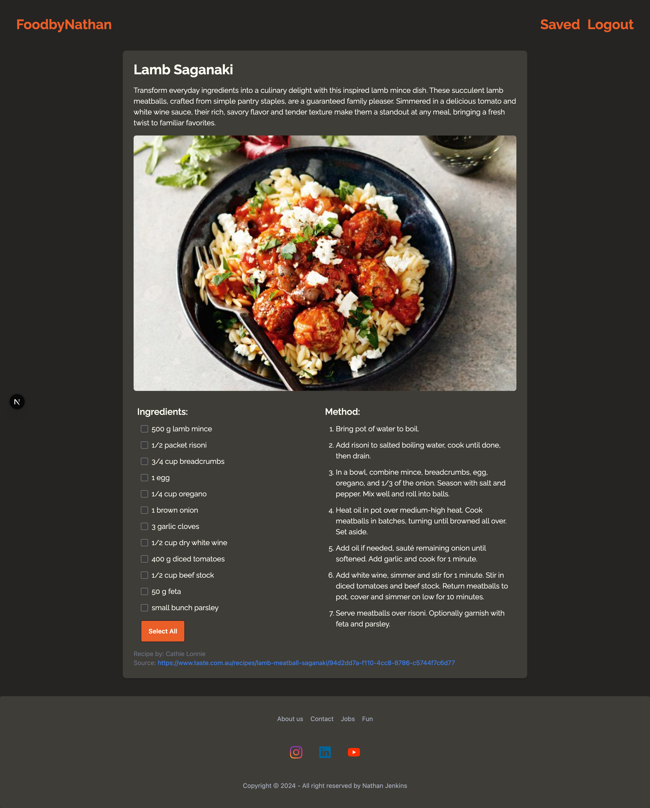

# Food Blog

Welcome to my food blog! 🍴 This project is my first venture into the world of **Next.js**, **Google Authentication**, and **MongoDB**, and it's been an incredible learning experience. I created this blog to share my love for cooking and to document delicious recipes for fellow food enthusiasts.

## Features

- **Next.js** for a seamless, server-rendered, and highly optimized web experience.
- **Google Authentication** to let users log in securely and easily.
- **MongoDB** as the database for storing user accounts, recipes, and other data.
- A collection of mouthwatering recipes that are easy to follow.
- A user-friendly interface designed for quick navigation and recipe discovery.

## My Journey
This project marked my first time working with these technologies, and I thoroughly enjoyed the process. There were challenges, but each hurdle was an opportunity to grow and learn. By the end of it, I had a deeper appreciation for the power of modern web development tools.

## About The Project 

   ### Homepage view no.1
   

   ### Homepage view no.2
   

   ### View recipe page
   

## Live demo 

* View live demo here:
   ```bash
   https://
   ```

## Future Plans

- Add more recipe categories and advanced filtering options.
- Allow users to submit their own recipes.
- Improve accessibility and responsive design.

Thank you for visiting my food blog! I hope you enjoy exploring the recipes as much as I enjoyed building this project. If you have any feedback or suggestions, feel free to reach outx. 